[中文](./ARCHITECTURE.md) | English

# Architecture Design

This document provides a detailed introduction to DataAgent's system architecture, core capabilities, and technical implementation.

## Overall Architecture Diagram

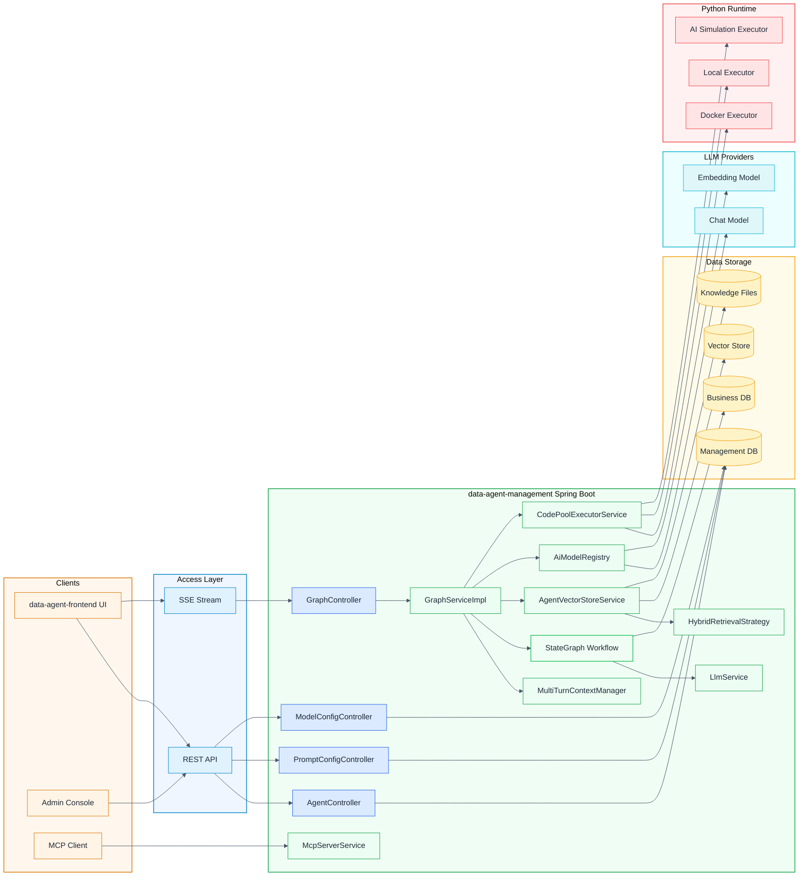

## Runtime Main Flow

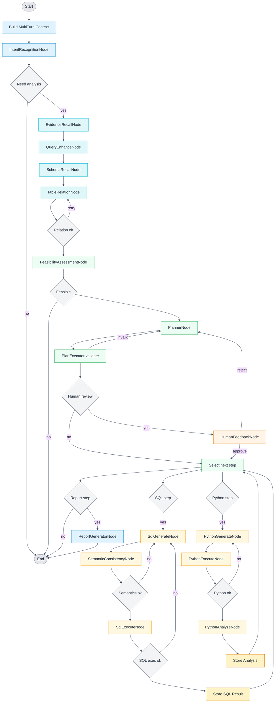

## Key Capability Description

### 1. Human Feedback Mechanism

#### Key Points

- **Entry**: Runtime request parameter `humanFeedback=true` (`GraphController` → `GraphServiceImpl`)
- **Data Field**: `human_review_enabled` uses request parameter
- **Graph Orchestration**: `PlanExecutorNode` detects `HUMAN_REVIEW_ENABLED`, transitions to `HumanFeedbackNode`
- **Pause and Resume**: `CompiledGraph` uses `interruptBefore(HUMAN_FEEDBACK_NODE)`, enters "wait" state when no feedback, continues execution through `threadId` when feedback arrives
- **Feedback Result**: Approve continues execution; Reject returns to `PlannerNode` and triggers replanning

#### Architecture Diagram

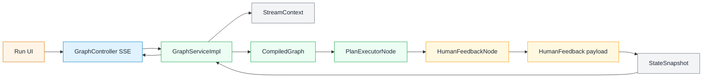

#### Flow Diagram

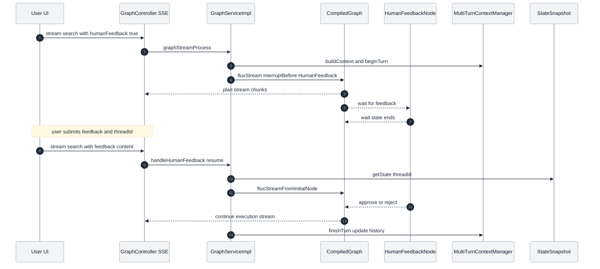

### 2. Prompt Configuration and Auto-Optimization

#### Key Points

- **Configuration Entry**: `/api/prompt-config/*`, data table `user_prompt_config`
- **Scope**: Supports binding by `agentId` or global configuration (`agentId` is null)
- **Prompt Types**: `report-generator`, `planner`, `sql-generator`, `python-generator`, `rewrite`
- **Auto-Optimization Method**: `ReportGeneratorNode` fetches enabled configurations (sorted by `priority` and `display_order`), concatenates "optimization requirements" through `PromptHelper.buildReportGeneratorPromptWithOptimization`
- **Current Implementation Focus**: Report generation node has implemented optimization; other types are reserved capabilities

#### Architecture Diagram

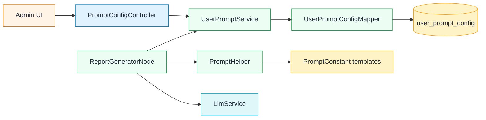

#### Flow Diagram

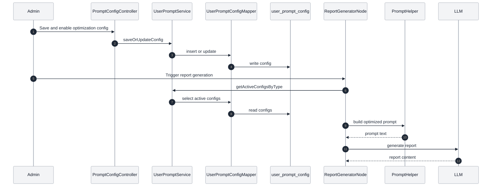

### 3. RAG Retrieval Enhancement

#### Key Points

- **Query Rewriting**: `EvidenceRecallNode` calls LLM to generate independent retrieval questions
- **Recall Channels**: `AgentVectorStoreService` performs vector retrieval; optional hybrid retrieval (vector + keyword, `AbstractHybridRetrievalStrategy`)
- **Document Types**: Business knowledge + Agent knowledge, filtered by metadata and merged as evidence injected into subsequent prompts
- **Key Configuration**: `spring.ai.alibaba.data-agent.vector-store.enable-hybrid-search` and similarity/TopK parameters

#### Architecture Diagram

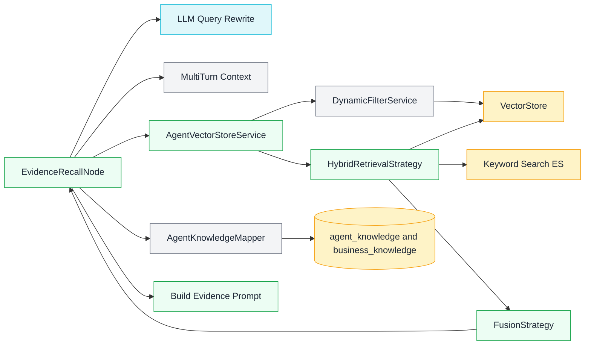

#### Flow Diagram

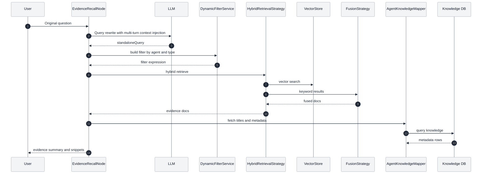

### 4. Report Generation and Summary Generation

#### Key Points

- **Report Node**: `ReportGeneratorNode` reads plan, SQL/Python results and summary suggestions (`summary_and_recommendations`)
- **Output Format**: Default HTML, `plainReport=true` outputs Markdown (concise report)
- **Optimization Prompts**: Automatically concatenates optimization configuration before generating report

#### Architecture Diagram

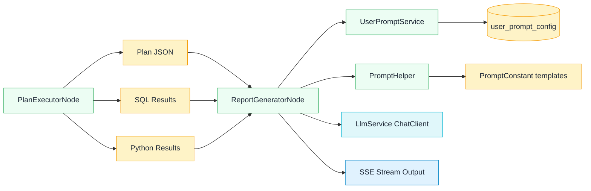

#### Flow Diagram

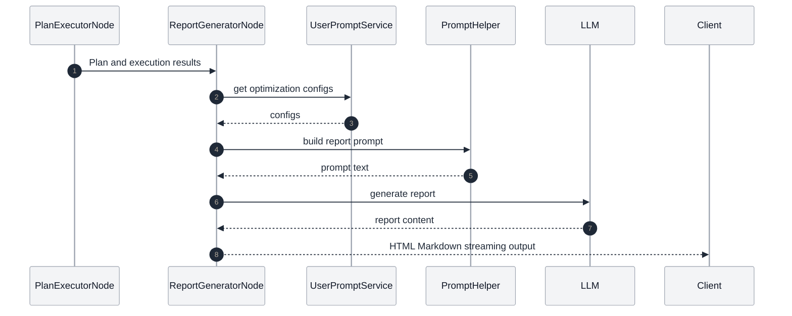

### 5. Streaming Output and Multi-turn Conversation

#### Key Points

- **Streaming Output**: `GraphController` SSE + `GraphServiceImpl` streaming processing
- **Text Markers**: `TextType` marks SQL/JSON/HTML/Markdown in the stream, frontend renders accordingly
- **Multi-turn Conversation**: `MultiTurnContextManager` records "user question + planning results", injected into subsequent requests
- **Mode Switching**: `spring.ai.alibaba.data-agent.llm-service-type` supports `STREAM/BLOCK`

#### Architecture Diagram

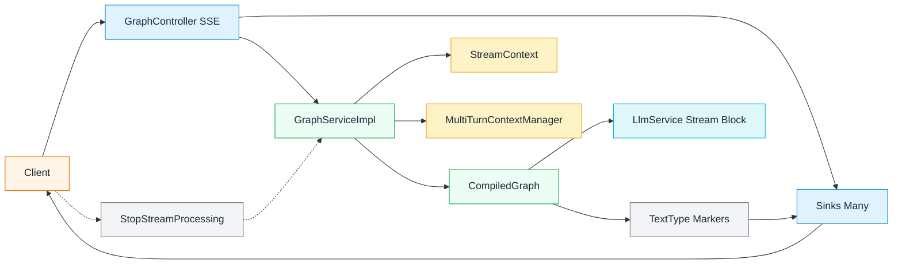

#### Flow Diagram

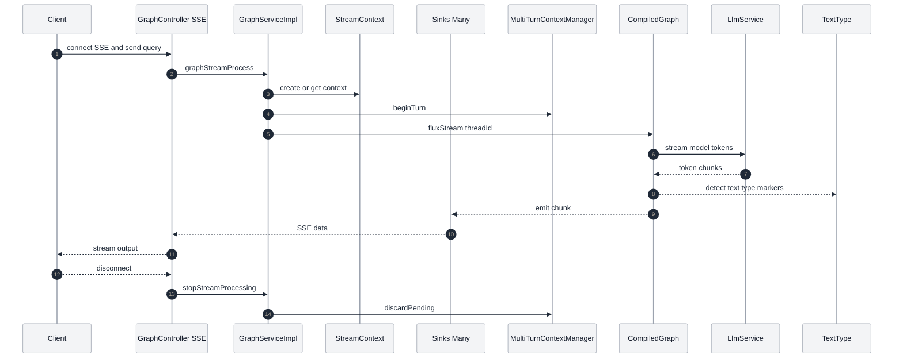

### 6. MCP and Multi-Model Scheduling

#### Key Points

- **MCP**: `McpServerService` provides NL2SQL and Agent list tools, using Mcp Server Boot Starter
- **Multi-Model Scheduling**: `ModelConfig*` configures models, `AiModelRegistry` caches current Chat/Embedding models and supports hot-swapping (only one active model per type at a time)
- **Built-in Tools**: `nl2SqlToolCallback`, `listAgentsToolCallback`

#### Architecture Diagram

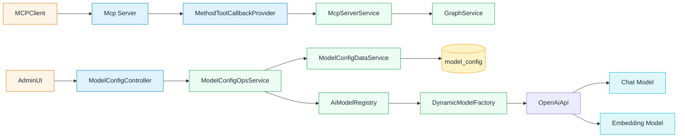

#### Flow Diagram

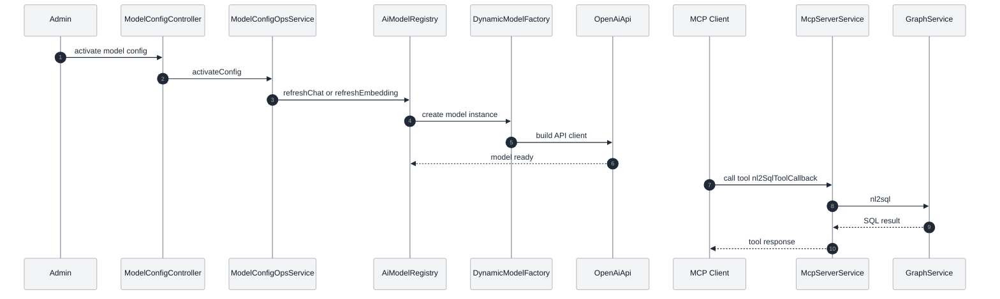

### 7. API Key and Permission Management

#### Key Points

- **Management**: `AgentController` supports generating, resetting, deleting, and enabling/disabling API Keys
- **Data Fields**: `agent.api_key` and `agent.api_key_enabled`
- **Calling Method**: Request header `X-API-Key` (requires implementing backend validation logic yourself)
- **Note**: By default, the backend does not intercept `X-API-Key` for authentication; production needs to add validation yourself

#### Architecture Diagram

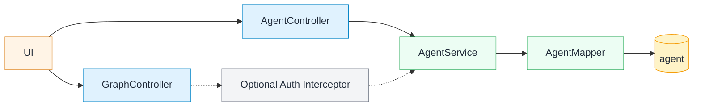

#### Flow Diagram

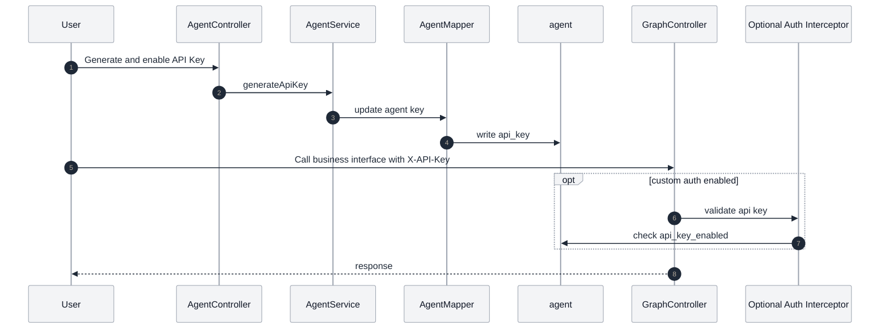

### 8. Python Execution and Result Return

#### Key Points

- **Code Generation**: `PythonGenerateNode` generates Python based on plan and SQL results
- **Code Execution**: `PythonExecuteNode` uses `CodePoolExecutorService` (Docker/Local/AI simulation)
- **Execution Configuration**: `spring.ai.alibaba.data-agent.code-executor.*` (default Docker image `continuumio/anaconda3:latest`)
- **Result Return**: Execution results are written back to `PYTHON_EXECUTE_NODE_OUTPUT`, `PythonAnalyzeNode` summarizes and writes to `SQL_EXECUTE_NODE_OUTPUT` for final report

#### Architecture Diagram

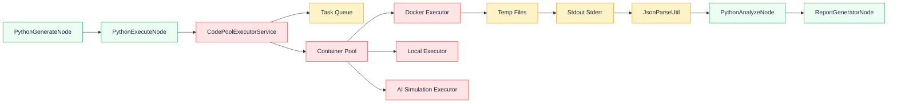

#### Flow Diagram

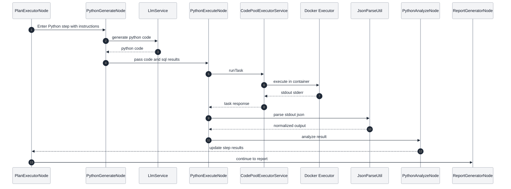

## Related Documents

- [Quick Start](QUICK_START-en.md) - Installation and configuration guide
- [Advanced Features](ADVANCED_FEATURES-en.md) - API calls and MCP server
- [Developer Documentation](DEVELOPER_GUIDE-en.md) - Contribution guide
