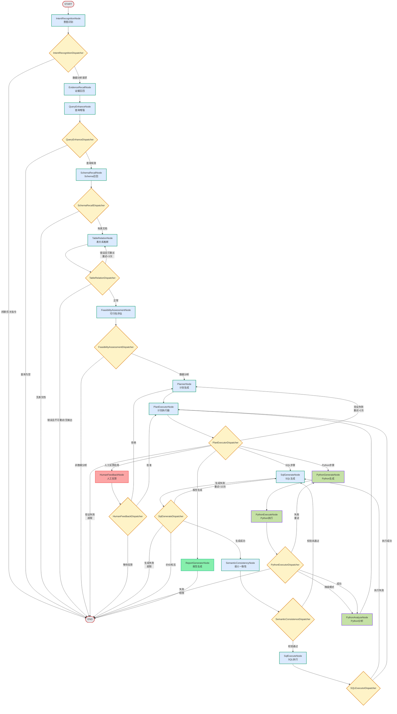

# DataAgent 工作流图

本文档基于 `DataAgentConfiguration.java` 中定义的 StateGraph 以及各 `Dispatcher` 的路由逻辑，绘制了完整的工作流程图。

## 流程图概览



## 各节点详细说明

### 1. 意图识别阶段

| 节点 | 职责 | 输出 Key | 说明 |
|------|--------|-----------|------|
| **IntentRecognitionNode** | 识别用户意图，判断是否为数据分析请求 | `INTENT_RECOGNITION_NODE_OUTPUT` | 基于 LLM 分类：闲聊/无关指令 vs 数据分析 |

**IntentRecognitionDispatcher 路由规则:**
- `《闲聊或无关指令》` → **END**
- 其他（数据分析请求）→ **EvidenceRecallNode**

---

### 2. 知识召回阶段

| 节点 | 职责 | 输出 Key | 说明 |
|------|--------|-----------|------|
| **EvidenceRecallNode** | RAG 检索业务知识、智能体知识 | `EVIDENCE` | 向量检索 + 混合搜索 |
| **QueryEnhanceNode** | 查询重写，生成独立检索问题 | `QUERY_ENHANCE_NODE_OUTPUT` | 生成 canonicalQuery 和 expandedQueries |
| **SchemaRecallNode** | 召回相关数据库表结构 | `TABLE_DOCUMENTS_FOR_SCHEMA_OUTPUT`<br/>`COLUMN_DOCUMENTS__FOR_SCHEMA_OUTPUT` | 基于语义模型的表和列召回 |
| **TableRelationNode** | 推断表之间的关联关系 | `TABLE_RELATION_OUTPUT`<br/>`TABLE_RELATION_EXCEPTION_OUTPUT`<br/>`TABLE_RELATION_RETRY_COUNT` | 多表 JOIN 场景关键 |

**Dispatcher 路由规则:**

| Dispatcher | 条件 | 目标节点 |
|-----------|--------|----------|
| **QueryEnhanceDispatcher** | 查询为空 | END |
| | 查询有效 | SchemaRecallNode |
| **SchemaRecallDispatcher** | 无表文档 | END |
| | 有表文档 | TableRelationNode |
| **TableRelationDispatcher** | 错误且可重试 & 重试<3 | TableRelationNode (retry) |
| | 错误且不可重试/无输出 | END |
| | 正常 | FeasibilityAssessmentNode |

---

### 3. 可行性评估阶段

| 节点 | 职责 | 输出 Key | 说明 |
|------|--------|-----------|------|
| **FeasibilityAssessmentNode** | 评估需求是否可用现有数据满足 | `FEASIBILITY_ASSESSMENT_NODE_OUTPUT` | 分析需求类型和内容 |

**FeasibilityAssessmentDispatcher 路由规则:**
- 包含 `【需求类型】：《数据分析》` → **PlannerNode**
- 其他 → **END**

---

### 4. 计划生成与执行阶段

| 节点 | 职责 | 输出 Key | 说明 |
|------|--------|-----------|------|
| **PlannerNode** | 生成执行计划（SQL/Python 步骤） | `PLANNER_NODE_OUTPUT` | 分解为多个步骤 |
| **PlanExecutorNode** | 验证计划并分发执行 | `PLAN_NEXT_NODE`<br/>`PLAN_CURRENT_STEP`<br/>`PLAN_VALIDATION_STATUS`<br/>`PLAN_REPAIR_COUNT` | 核心调度节点 |

**PlanExecutorDispatcher 路由规则:**

| 条件 | 目标节点 |
|------|----------|
| 验证失败 & 修复次数 > 2 | END |
| 验证失败 | PlannerNode (retry) |
| 验证通过 & nextNode = END | END |
| 验证通过 & 人工反馈启用 | HumanFeedbackNode |
| 验证通过 & SQL 步骤 | SqlGenerateNode |
| 验证通过 & Python 步骤 | PythonGenerateNode |
| 验证通过 & 报告步骤 | ReportGeneratorNode |

---

### 5. 人工反馈阶段

| 节点 | 职责 | 输出 Key | 说明 |
|------|--------|-----------|------|
| **HumanFeedbackNode** | 等待用户反馈（批准/拒绝/修改） | `HUMAN_FEEDBACK_DATA`<br/>`human_next_node` | Human-in-the-loop 机制 |

**HumanFeedbackDispatcher 路由规则:**

| 条件 | 目标节点 |
|------|----------|
| `human_next_node` = "WAIT_FOR_FEEDBACK" | END (等待反馈) |
| `human_next_node` = "PLANNER_NODE" (拒绝) | PlannerNode |
| 其他 | PlanExecutorNode |

---

### 6. SQL 执行路径

| 节点 | 职责 | 输出 Key | 说明 |
|------|--------|-----------|------|
| **SqlGenerateNode** | 生成 SQL 查询语句 | `SQL_GENERATE_OUTPUT`<br/>`SQL_GENERATE_COUNT`<br/>`SQL_REGENERATE_REASON` | 基于计划、schema 和 evidence |
| **SemanticConsistencyNode** | 验证 SQL 语义正确性 | `SEMANTIC_CONSISTENCY_NODE_OUTPUT` | 检查 SQL 是否符合查询意图 |
| **SqlExecuteNode** | 执行 SQL 并获取结果 | `SQL_EXECUTE_NODE_OUTPUT`<br/>`SQL_REGENERATE_REASON` | 连接业务数据库执行 |

**Dispatcher 路由规则:**

| Dispatcher | 条件 | 目标节点 |
|-----------|--------|----------|
| **SqlGenerateDispatcher** | 生成失败 & 次数 < 10 | SqlGenerateNode (retry) |
| | 生成失败 & 次数 ≥ 10 | END |
| | 输出 = "END" | END |
| | 生成成功 | SemanticConsistencyNode |
| **SemanticConsistenceDispatcher** | 校验未通过 | SqlGenerateNode |
| | 校验通过 | SqlExecuteNode |
| **SQLExecutorDispatcher** | SQL 执行失败 | SqlGenerateNode |
| | SQL 执行成功 | PlanExecutorNode |

---

### 7. Python 执行路径

| 节点 | 职责 | 输出 Key | 说明 |
|------|--------|-----------|------|
| **PythonGenerateNode** | 生成 Python 分析代码 | `PYTHON_GENERATE_NODE_OUTPUT` | 统计分析、ML 预测等 |
| **PythonExecuteNode** | 执行 Python 代码 | `PYTHON_EXECUTE_NODE_OUTPUT`<br/>`PYTHON_IS_SUCCESS`<br/>`PYTHON_TRIES_COUNT`<br/>`PYTHON_FALLBACK_MODE` | Docker/Local/AI 模拟环境 |
| **PythonAnalyzeNode** | 分析 Python 执行结果 | `PYTHON_ANALYSIS_NODE_OUTPUT` | 解析 stdout/stderr |

**PythonExecutorDispatcher 路由规则:**

| 条件 | 目标节点 |
|------|----------|
| 降级模式 | PythonAnalyzeNode |
| 失败 & 次数 ≥ maxTries | END |
| 失败 | PythonGenerateNode (retry) |
| 成功 | PythonAnalyzeNode |

---

### 8. 报告生成阶段

| 节点 | 职责 | 输出 Key | 说明 |
|------|--------|-----------|------|
| **ReportGeneratorNode** | 生成可视化报告 | `RESULT` | HTML (ECharts) / Markdown |

---

## State Key 策略

所有 State Key 使用 `KeyStrategy.REPLACE` 策略，即每次调用直接替换旧值。

### 常用 State Key

| Key | 类型 | 说明 |
|-----|------|------|
| `INPUT_KEY` | String | 用户输入 |
| `AGENT_ID` | String | 智能体 ID |
| `MULTI_TURN_CONTEXT` | Object | 多轮对话上下文 |
| `INTENT_RECOGNITION_NODE_OUTPUT` | DTO | 意图识别结果 |
| `EVIDENCE` | List<Document> | 召回的知识文档 |
| `QUERY_ENHANCE_NODE_OUTPUT` | DTO | 查询增强结果 |
| `TABLE_DOCUMENTS_FOR_SCHEMA_OUTPUT` | List<Document> | 召回的表文档 |
| `TABLE_RELATION_OUTPUT` | String | 表关系 JSON |
| `FEASIBILITY_ASSESSMENT_NODE_OUTPUT` | String | 可行性评估结果 |
| `PLANNER_NODE_OUTPUT` | String | 执行计划 JSON |
| `PLAN_NEXT_NODE` | String | 下一个节点名称 |
| `PLAN_VALIDATION_STATUS` | Boolean | 计划验证状态 |
| `PLAN_REPAIR_COUNT` | Integer | 计划修复次数 |
| `HUMAN_REVIEW_ENABLED` | Boolean | 人工反馈启用 |
| `HUMAN_FEEDBACK_DATA` | Object | 人工反馈数据 |
| `SQL_GENERATE_OUTPUT` | String | 生成的 SQL |
| `SQL_GENERATE_COUNT` | Integer | SQL 生成次数 |
| `SQL_REGENERATE_REASON` | SqlRetryDto | SQL 重生成原因 |
| `SEMANTIC_CONSISTENCY_NODE_OUTPUT` | Boolean | 语义一致性校验结果 |
| `SQL_EXECUTE_NODE_OUTPUT` | String | SQL 执行结果 |
| `PYTHON_GENERATE_NODE_OUTPUT` | String | 生成的 Python 代码 |
| `PYTHON_IS_SUCCESS` | Boolean | Python 执行是否成功 |
| `PYTHON_TRIES_COUNT` | Integer | Python 尝试次数 |
| `PYTHON_FALLBACK_MODE` | Boolean | Python 降级模式 |
| `PYTHON_EXECUTE_NODE_OUTPUT` | String | Python 执行输出 |
| `PYTHON_ANALYSIS_NODE_OUTPUT` | String | Python 分析结果 |
| `IS_ONLY_NL2SQL` | Boolean | 是否仅 NL2SQL 模式 |
| `RESULT` | String | 最终结果 |

---

## 完整配置代码 (DataAgentConfiguration.java)

```java
@Bean
public StateGraph nl2sqlGraph(NodeBeanUtil nodeBeanUtil, CodeExecutorProperties codeExecutorProperties) {

    StateGraph stateGraph = new StateGraph(NL2SQL_GRAPH_NAME, keyStrategyFactory)
        .addNode(INTENT_RECOGNITION_NODE, nodeBeanUtil.getNodeBeanAsync(IntentRecognitionNode.class))
        .addNode(EVIDENCE_RECALL_NODE, nodeBeanUtil.getNodeBeanAsync(EvidenceRecallNode.class))
        .addNode(QUERY_ENHANCE_NODE, nodeBeanUtil.getNodeBeanAsync(QueryEnhanceNode.class))
        .addNode(SCHEMA_RECALL_NODE, nodeBeanUtil.getNodeBeanAsync(SchemaRecallNode.class))
        .addNode(TABLE_RELATION_NODE, nodeBeanUtil.getNodeBeanAsync(TableRelationNode.class))
        .addNode(FEASIBILITY_ASSESSMENT_NODE, nodeBeanUtil.getNodeBeanAsync(FeasibilityAssessmentNode.class))
        .addNode(SQL_GENERATE_NODE, nodeBeanUtil.getNodeBeanAsync(SqlGenerateNode.class))
        .addNode(PLANNER_NODE, nodeBeanUtil.getNodeBeanAsync(PlannerNode.class))
        .addNode(PLAN_EXECUTOR_NODE, nodeBeanUtil.getNodeBeanAsync(PlanExecutorNode.class))
        .addNode(SQL_EXECUTE_NODE, nodeBeanUtil.getNodeBeanAsync(SqlExecuteNode.class))
        .addNode(PYTHON_GENERATE_NODE, nodeBeanUtil.getNodeBeanAsync(PythonGenerateNode.class))
        .addNode(PYTHON_EXECUTE_NODE, nodeBeanUtil.getNodeBeanAsync(PythonExecuteNode.class))
        .addNode(PYTHON_ANALYZE_NODE, nodeBeanUtil.getNodeBeanAsync(PythonAnalyzeNode.class))
        .addNode(REPORT_GENERATOR_NODE, nodeBeanUtil.getNodeBeanAsync(ReportGeneratorNode.class))
        .addNode(SEMANTIC_CONSISTENCY_NODE, nodeBeanUtil.getNodeBeanAsync(SemanticConsistencyNode.class))
        .addNode(HUMAN_FEEDBACK_NODE, nodeBeanUtil.getNodeBeanAsync(HumanFeedbackNode.class));

    stateGraph.addEdge(START, INTENT_RECOGNITION_NODE)
        .addConditionalEdges(INTENT_RECOGNITION_NODE, edge_async(new IntentRecognitionDispatcher()),
                Map.of(EVIDENCE_RECALL_NODE, EVIDENCE_RECALL_NODE, END, END))
        .addEdge(EVIDENCE_RECALL_NODE, QUERY_ENHANCE_NODE)
        .addConditionalEdges(QUERY_ENHANCE_NODE, edge_async(new QueryEnhanceDispatcher()),
                Map.of(SCHEMA_RECALL_NODE, SCHEMA_RECALL_NODE, END, END))
        .addConditionalEdges(SCHEMA_RECALL_NODE, edge_async(new SchemaRecallDispatcher()),
                Map.of(TABLE_RELATION_NODE, TABLE_RELATION_NODE, END, END))
        .addConditionalEdges(TABLE_RELATION_NODE, edge_async(new TableRelationDispatcher()),
                Map.of(FEASIBILITY_ASSESSMENT_NODE, FEASIBILITY_ASSESSMENT_NODE, END, END, TABLE_RELATION_NODE,
                        TABLE_RELATION_NODE)) // retry
        .addConditionalEdges(FEASIBILITY_ASSESSMENT_NODE, edge_async(new FeasibilityAssessmentDispatcher()),
                Map.of(PLANNER_NODE, PLANNER_NODE, END, END))
        .addEdge(PLANNER_NODE, PLAN_EXECUTOR_NODE)
        .addEdge(PYTHON_GENERATE_NODE, PYTHON_EXECUTE_NODE)
        .addConditionalEdges(PYTHON_EXECUTE_NODE, edge_async(new PythonExecutorDispatcher(codeExecutorProperties)),
                Map.of(PYTHON_ANALYZE_NODE, PYTHON_ANALYZE_NODE, END, END, PYTHON_GENERATE_NODE,
                        PYTHON_GENERATE_NODE))
        .addEdge(PYTHON_ANALYZE_NODE, PLAN_EXECUTOR_NODE)
        .addConditionalEdges(PLAN_EXECUTOR_NODE, edge_async(new PlanExecutorDispatcher()), Map.of(
                PLANNER_NODE, PLANNER_NODE,
                SQL_GENERATE_NODE, SQL_GENERATE_NODE, PYTHON_GENERATE_NODE, PYTHON_GENERATE_NODE,
                REPORT_GENERATOR_NODE, REPORT_GENERATOR_NODE,
                HUMAN_FEEDBACK_NODE, HUMAN_FEEDBACK_NODE,
                END, END))
        .addConditionalEdges(HUMAN_FEEDBACK_NODE, edge_async(new HumanFeedbackDispatcher()), Map.of(
                PLANNER_NODE, PLANNER_NODE,
                PLAN_EXECUTOR_NODE, PLAN_EXECUTOR_NODE,
                END, END))
        .addEdge(REPORT_GENERATOR_NODE, END)
        .addConditionalEdges(SQL_GENERATE_NODE, nodeBeanUtil.getEdgeBeanAsync(SqlGenerateDispatcher.class),
                Map.of(SQL_GENERATE_NODE, SQL_GENERATE_NODE, END, END, SEMANTIC_CONSISTENCY_NODE,
                        SEMANTIC_CONSISTENCY_NODE))
        .addConditionalEdges(SEMANTIC_CONSISTENCY_NODE, edge_async(new SemanticConsistenceDispatcher()),
                Map.of(SQL_GENERATE_NODE, SQL_GENERATE_NODE, SQL_EXECUTE_NODE, SQL_EXECUTE_NODE))
        .addConditionalEdges(SQL_EXECUTE_NODE, edge_async(new SQLExecutorDispatcher()),
                Map.of(SQL_GENERATE_NODE, SQL_GENERATE_NODE, PLAN_EXECUTOR_NODE, PLAN_EXECUTOR_NODE));

    return stateGraph;
}
```

---

## 相关文件位置

| 类型 | 路径 |
|------|------|
| **Configuration** | `data-agent-management/src/main/java/com/alibaba/cloud/ai/dataagent/config/DataAgentConfiguration.java` |
| **Nodes** | `data-agent-management/src/main/java/com/alibaba/cloud/ai/dataagent/workflow/node/*.java` |
| **Dispatchers** | `data-agent-management/src/main/java/com/alibaba/cloud/ai/dataagent/workflow/dispatcher/*.java` |
| **Constants** | `data-agent-management/src/main/java/com/alibaba/cloud/ai/dataagent/constant/Constant.java` |
